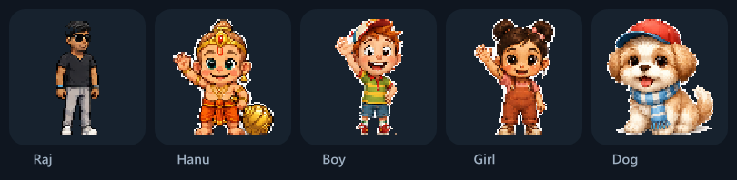

<div align="center">


<p>
  <a href="https://github.com/RudraMind/MiniMe/releases/latest"></a>
  
  <a href="LICENSE"></a>
</p>

### **[⬇ Download for Windows or macOS](https://github.com/RudraMind/MiniMe/releases/latest)**

*No admin rights. No account. No telemetry.*

</div>

---

<table>
<tr>
<td width="40%" align="center">
  
</td>
<td width="60%">

### A coworker who sits with you

MiniMe wanders your desktop and does their own thing.

Start a focus session and they **sit down and work beside you**.

That's *body doubling* — someone visibly working nearby makes it easier to
start, and easier to keep going.

They'll also remind you to stretch and drink water.

</td>
</tr>
</table>

---

## 🍅 Focus sessions


- They sit and work for **25 minutes**
- **Reminders go silent** — that's the point
- Then you stretch together for **5 minutes**, and repeat
- Drag them anywhere; they'll settle in there

Lengths are yours to set.

---

## 💧 Nudges, not nags

| | |
|---|---|
| **Stretch** — hourly | A speech bubble. Never blocks you. |
| **Water** — every 45 min | Screen dims, 10-second countdown. **Esc skips it.** Switching apps closes it. |

Never blocks `Ctrl+Alt+Del`, `Alt+Tab` or Task Manager on Windows, and never blocks
`Cmd+Tab` or Force Quit on a Mac. You always win.

---

## 🎭 They have a personality


They dance, check their phone, cross their arms. Left-click to get a wave.
Drag them anywhere.

Optional: **follow your cursor**, or **react to the app you're in**.

---

## 🧑‍🤝‍🧑 Pick your companion



Five to choose from. Switch any time — right-click → **Character**, or from
Settings. Each one has their own poses: Hanu leaps with his mace at exercise
time and runs home to bed, the dog trots and sits, the kids stretch and jump.

**Pick the dog and you get fetch.** A bone sits on your desktop — drag it
anywhere and let go. He runs for it, picks it up, carries it back and holds it
until you throw again. About one throw in five he keeps it just out of reach.

---

## 🎨 Make them yours


Pick their shirt and trousers, and give them a name. (Outfit colours apply
to Raj; the other characters have their own fixed outfits.)

---

## 🏠 Send them home


Right-click the house → bed. They walk home, head inside, lights out.
Reminders pause until you wake them. Drag the house anywhere.

---

## Install

### The installer *(easiest)*

**[⬇ Download the latest release](https://github.com/RudraMind/MiniMe/releases/latest)** → run it → done.
Installs per-user, **no admin rights**.

> [!NOTE]
> **Windows** shows **"Windows protected your PC"** because the installer isn't
> code-signed. Click **More info → Run anyway**. Or build it yourself below —
> same result.

> [!IMPORTANT]
> **macOS takes one extra step.** The `.dmg` and `.zip` aren't signed by a
> registered Apple developer, so macOS says **"Apple cannot check "MiniMe" for
> malicious software"**. To let it through: **System Settings → Privacy &
> Security**, scroll down to **Security**, click **Open Anyway**, then enter your
> login password. That button only appears for about an hour after you first try
> to open the app.
>
> Control-clicking the app and choosing Open *used* to work; Apple removed that
> shortcut in [macOS Sequoia](https://developer.apple.com/news/?id=saqachfa).
> Signing this properly needs a paid Apple Developer account, so for now the
> **From source** route below is the friction-free one on a Mac.

### From source

Needs [Node.js](https://nodejs.org/) 18+.

```bash
git clone https://github.com/RudraMind/MiniMe.git
cd MiniMe
npm install
npm start
```

All artwork ships in the repo — no build step.

> **No terminal?** Download the ZIP, extract, then double-click
> **`START-MINIME.bat`** on Windows or **`START-MINIME.command`** on a Mac. Both
> install dependencies on first run, then start the app.

---

## Controls

| Action | How |
|---|---|
| Focus session | Right-click them, or the tray icon |
| Move them / the house | Drag it |
| Wave | Left-click them |
| Throw the bone *(dog only)* | Drag the bone and let go |
| Bed / wake | Right-click the house |
| Reminder now | Tray → **Drink now** / **Stretch now** |
| Settings | Right-click → **Settings…** |
| Quit | Tray → **Quit** |

They live in the tray — closing a window won't quit them.

---

## 🔒 Privacy

**No network code. Nothing leaves your machine.** No analytics, no account.
Settings sit in `%APPDATA%\mini-me\config.json` on Windows, and in
`~/Library/Application Support/mini-me/config.json` on a Mac.

The optional app-reactions feature reads only the foreground app's **name**
(`chrome`, `code`) — never window titles, URLs, or filenames. Off by default.

---

## Good to know

- **Windows and macOS** — the macOS build isn't code-signed yet, so it needs the
  one-time **Open Anyway** step described under Install
- **Primary monitor only** — won't break on multi-monitor, just stays put
- **No up/down walk poses** in the art, so vertical movement uses the side view

---

## For developers

```
main.js       lifecycle, windows, tray, timers, geometry
state.js      state machine — pure logic, no Electron imports
timers.js     pausable reminder schedulers
preload.js    contextBridge IPC surface
dock.js       macOS Dock and menu-bar edges
renderer/     chotu, overlay, settings UIs — plain HTML/CSS/JS
tools/        sprite + house slicers, icon and README art generators
test/         four headless behaviour harnesses, 298 assertions
```

`state.js` has no Electron dependency, so behaviour is testable from plain Node —
`npm test` needs no `node_modules` at all:

```bash
npm test      # ladder-sim (30), play-sim (29), facing-sim (205), fetch-sim (34)
```

`npm run dist` builds the Windows installer and `npm run dist:mac` builds the
macOS disk image and zip. Regenerating art needs `npm install sharp to-ico`, then
`npm run assets`, `node tools/slice-house.js` and `node tools/slice-character.js`.
`npm run verify:facing` compares every sprite against the facing table and needs
`sharp`.

[`BUILD_LOG.md`](BUILD_LOG.md) covers the real bugs hit along the way — sprite
masking, Windows packaging traps, and why the fixes look like they do.

---

<div align="center">

**[⬇ Download MiniMe](https://github.com/RudraMind/MiniMe/releases/latest)** · [Report a bug](https://github.com/RudraMind/MiniMe/issues) · [MIT](LICENSE)

</div>
