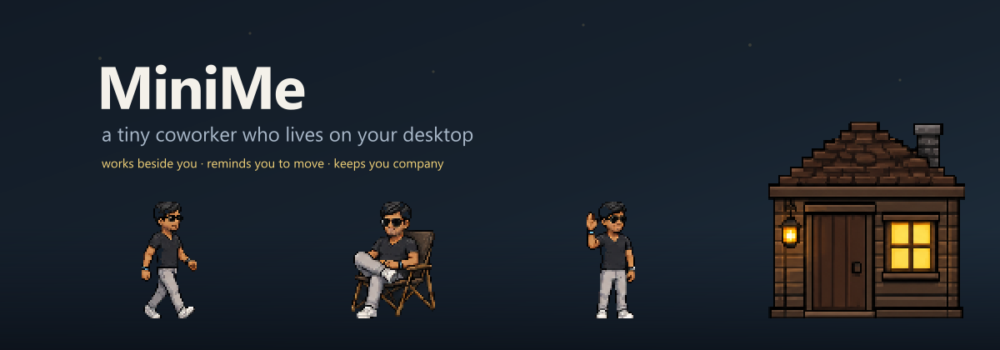
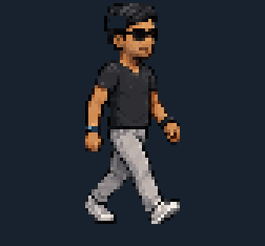
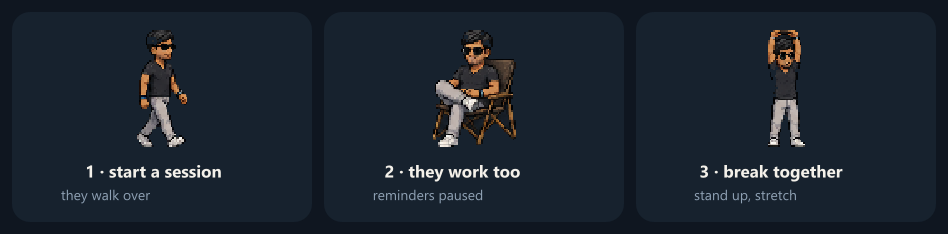
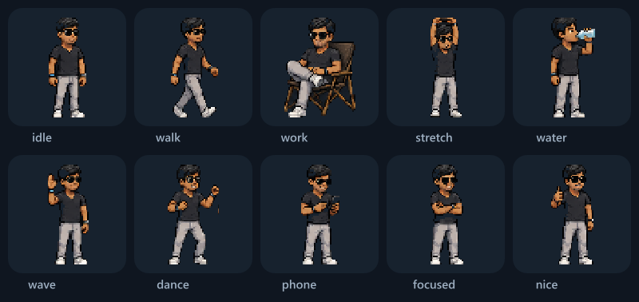
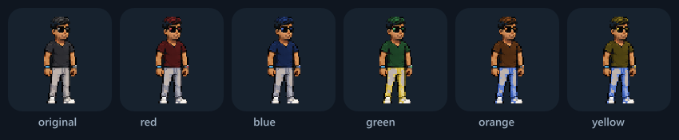
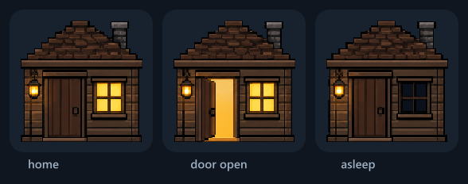

<div align="center">



<p>
  <a href="https://github.com/RudraMind/MiniMe/releases/latest"></a>
  
  <a href="LICENSE"></a>
</p>

### **[⬇ Download for Windows](https://github.com/RudraMind/MiniMe/releases/latest)**

*No admin rights. No account. No telemetry.*

</div>

---

<table>
<tr>
<td width="42%" align="center">
  
</td>
<td width="58%">

### Working alone is the hard part

MiniMe is a pixel-art companion who lives on your desktop. They wander around,
get on with their own thing, and — when you start a focus session — **sit down
and work right alongside you**.

It's a trick called *body doubling*: having someone else visibly working nearby
makes it easier to start a task and stay with it. MiniMe is that someone, minus
the small talk.

They'll also nudge you to stretch and drink water, because you won't.

</td>
</tr>
</table>

---

## 🍅 Focus sessions



Start a session and they walk over, sit down, and work for 25 minutes.
**All reminders go quiet** — an uninterrupted block is the whole point. When the
timer's up they stand, stretch with you for 5 minutes, then get back to it.

Drag them anywhere while they're working and they'll settle in at the new spot.
Session and break lengths are yours to set.

---

## 💧 Nudges that respect you

|  | |
|---|---|
| **Stretch** | Every hour they walk over and hold up a speech bubble. That's it — it never blocks you, never steals focus. |
| **Water** | Every 45 minutes the screen dims with a 10-second countdown. **Esc skips it instantly**, and it closes itself the moment you Alt-Tab away. |

It will never block `Ctrl+Alt+Del`, `Alt+Tab`, or Task Manager. If you're in the
middle of something, you win — always.

---

## 🎭 They have a personality



Between walks they dance, check their phone, cross their arms, sit down for a
rest. Left-click for a wave. Pick them up and drop them anywhere on screen.

**Optionally**, they'll follow your cursor around and sit down to relax when you
stop moving — or react to whatever app you switch to, with a pose to match.

---

## 🎨 Make them yours



Pick a shirt and trouser colour, and **give them a name** — it's used everywhere
in the menus. They're called `Chotu` out of the box.

---

## 🏠 And a home to go back to



Right-click the house to send them to bed. They walk all the way home, head
inside, and the lights go out — reminders pause until you wake them.
**Drag the house wherever you like**; it stays there.

---

## Install

### Option 1 — the installer *(easiest)*

**[⬇ Download the latest release](https://github.com/RudraMind/MiniMe/releases/latest)**, run it, done.
It installs per-user, so **no administrator rights are needed**.

> [!NOTE]
> Windows will show a **"Windows protected your PC"** screen, because the
> installer isn't code-signed (a signing certificate costs money). Click
> **More info → Run anyway**. If you'd rather not trust that, build it yourself
> from source below — the result is identical.

### Option 2 — run from source

Needs [Node.js](https://nodejs.org/) 18+ *(grab the LTS build and click through)*.

```bash
git clone https://github.com/RudraMind/MiniMe.git
cd MiniMe
npm install
npm start
```

All the artwork ships in the repo, so there's no build step and no image
toolchain to install.

> **Don't use a terminal?** Download the repo as a ZIP, extract it, and
> **double-click `START-MINIME.bat`**. It sets everything up the first time and
> starts MiniMe. If Node.js is missing it tells you exactly what to get.

---

## Using it

| Action | How |
|---|---|
| Start / stop a focus session | Right-click them, or the tray icon |
| Move them | Just drag them |
| Move their house | Drag the house |
| Wave | Left-click them |
| Send to bed / wake up | Right-click the house |
| Reminder right now | Tray icon → **Drink now** / **Stretch now** |
| Settings | Right-click anything → **Settings…** |
| Quit | Tray icon → **Quit** |

Closing a window doesn't quit MiniMe — they live in the system tray.

**Settings** covers their name, focus and break lengths, reminder intervals,
walk speed, outfit colours, cursor-following, app moods, quiet hours, and
start-with-Windows. Everything persists across restarts.

---

## 🔒 Privacy

MiniMe has **no network code at all**. Nothing is uploaded, no analytics, no
account, no telemetry. Settings live in a plain JSON file on your machine
(`%APPDATA%\mini-me\config.json`).

The optional *"react to my apps"* feature reads only the **name** of the
foreground app — `chrome`, `code` — and never window titles, page names, URLs,
or filenames. It's off by default, and the name it reads is used to pick a pose
and then discarded.

---

## Good to know

- **Windows only.** MiniMe leans on Windows behaviour for transparent,
  always-on-top, click-through windows. No macOS or Linux build.
- **Primary monitor only.** Multi-monitor setups won't break it, but they'll
  stay on your main screen.
- **The artwork has no up/down walking poses**, so vertical movement uses the
  side-on walk. You'll notice it if you look for it.

---

## For developers

```
main.js       app lifecycle, windows, tray, timers, screen geometry
state.js      the state machine — pure logic, zero Electron imports
timers.js     pausable reminder schedulers
preload.js    the contextBridge IPC surface
renderer/     chotu, overlay and settings UIs — plain HTML/CSS/JS
tools/        sprite + house slicers, icon and README art generators
```

`state.js` has no Electron dependency on purpose, so behaviour can be tested
from plain Node without launching anything:

```bash
node -e "const {PalState}=require('./state.js'); /* drive tick() and assert */"
```

Build the installer with `npm run dist`. Regenerating artwork needs the optional
deps: `npm install sharp to-ico`, then `npm run assets` and
`node tools/slice-house.js`.

[`BUILD_LOG.md`](BUILD_LOG.md) documents the real bugs found along the way and
why the fixes look the way they do — including the sprite-masking approach and
a few Windows packaging traps.

---

<div align="center">

**[⬇ Download MiniMe](https://github.com/RudraMind/MiniMe/releases/latest)** · [Report a bug](https://github.com/RudraMind/MiniMe/issues) · [MIT licensed](LICENSE)

</div>
